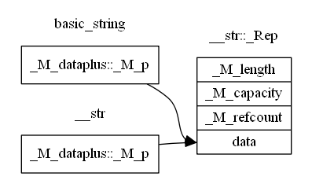
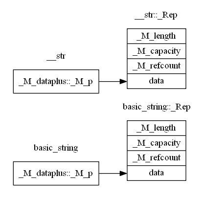

basic_string and string
=======================

# 概述

平时使用stl的basic_string和string的时候都包含的是string这个文件，这个文件在/usr/include/c++/4.4.4/
目录中，这个文件只是包含了实现basic_string和string时所需要的所有文件，basic_string和string
的代码主要在bits/basic_string.h和bits/basic_string.tcc两个文件中实现。

# 基本结构

# 构造函数

basic_string的构造函数在bits/basic_string.h的419~497行生命，但是除了默认的构造函数basic_string()
在这个文件中实现外，其他的构造函数都是在bits/basic_string.tcc中实现的。

## 默认构造函数basic_string()

## 拷贝构造函数basic_string(const basic_string& __str)

拷贝构造函数的实现在bits/basic_string.tcc的169~175行。这里面主要用到了basic_string::_Rep::_M_grab
函数。_M_grab函数实现在bits/basic_string.h的217~222行，这里通过判断当前的_Rep是否可共享以及两个
分配器是否相等来确定使用_M_refcopy还是_M_clone来获取实际数据的指针。

### _M_refcopy()

_M_refcopy函数定义在bits/basic_string.h的242~250行，249行通过_M_refdata返回了指向当前字符串的指针。
248行__gnu_cxx::__atomic_add_dispatch函数定义在ext/atomicity.h的87~99行，在这里这个函数就是将
_M_refcount加1。

可以看出拷贝构造函数在可以共享并且使用的分配器相同的情况下就是将两个basic_string::_M_dataplus::_M_p
指向相同的字符串。

### _M_clone()

_M_clone函数定义在bits/basic_string.tcc的622~636行，根据当前字符串的长度_M_length和新增的大小__res
来计算新的容量__requested_cap，然后_S_create函数生成一个新的basic_string::_Rep，并且把当前字符串的
内容拷贝到新的_Rep的字符串中，将新的_Rep字符串设置长度和可共享，然后返回_Rep指向的新的字符串的指针。

_M_grab中使用_M_clone的时候__res使用了默认参数0，这样生成的新的字符串就是_M_length和_M_capacity都是
当前字符串的_M_length。

### 总结

在拷贝构造函数basic_string(const basic_string& __str)中，当__str是可共享的并且两个字符串使用相同的
分配器的时候实际上新的字符串执行的时候__str相同的字符串，否则就根据__str的字符串拷贝一份一模一样的。

两种情况下的内存结构如图:

## basic_string(size_type __n, _CharT __c, const _Alloc& __a)

这个构造函数通过特定的字符和字符的个数来构造字符串，它定义在bits/basic_string.tcc的219~223行，它是
通过_S_construct这个函数来构造的。这个函数在介绍默认构造函数的时候已经介绍过了，不同的时当时由于
__n是0所以并没有调用_M_assign这个函数。

### _M_assign

_M_assign定义在bits/basic_string.h的356~363行，根据长度调用了traits_type的两个重载的assign函数。
traits_type是什么呢？看看basic_string的类的开始部分。110行说明traits_type是_Traits的重定义，而
_Traits是模板参数，那么具体的类型就不知道了。bits/stringfwd.h的50~52行给出了默认的模板参数，
_Traits = char_traits<_CharT>。

#### char_traits

char_traits是字符特征类，它定义在bits/char_traits.h的230~232行，std::char_traits从__gnu_cxx::char_traits
继承。这样__gnu_cxx::char_traits::assign就是实际代码执行的地方。assign是重载函数，包括两个版本。

assign(char_type& __c1, const char_type& __c2)是单个字符的赋值函数，直接使用char_type对应的赋值符号来实现。

assign(char_type* __s, std::size_t __n, char_type __a);是使用一个特定的字符填充字符数组，它定义在
bits/char_traits.h的203~211行，直接使用std::fill_n实现。

#### char_traits<char>

这里还有一个char_traits的char特化类，它的assign是专门针对char类型的，单个字符赋值函数也是直接使用
赋值符号实现的，另一个assign函数使用了__builtin_memset函数实现。(这个函数我不太清楚它到底是什么
我猜想应该是和memset函数相同的功能，但是是gcc内部的实现)

# 迭代器相关函数

bits/basic_string.h的548~621行定义了basic_string与迭代器相关的函数。

## begin和end

begin和end函数都有可读写的和只读的版本，begin是返回指向第一个字符的迭代器，end是返回
指向最后一个字符下一个字符的迭代器，但是可读写版本和只读版本之的差别只有是否调用了_M_leak
函数，并且可读写迭代器函数上面注释的最后一句提到了不共享字符串。

### _M_leak和_M_leak_hard

函数_M_leak定义在bits/basic_string.h的298~303行，这个函数主要是给begin，end以及operator[]，at这样
的函数使用的，目的是生成非共享的字符串。_M_leak首先判断了当前字符串是否为共享，如果共享则调用
_M_leak_hard函数强制变成非共享的。

函数_M_leak_hard定义在bits/basic_string.tcc的453~465行，当前字符串是共享的情况下调用_M_mutate函数
生成新的_Rep，其实_M_mutate函数还有其他的功能，但是这里主要是生成新的_Rep。_M_mutate函数就定义在
下面的467~498行，_M_leak_hard函数采用3个0来调用_M_mutate，这样__old_size, __new_size以及__how_much
都等于当前字符串的size()。476行的判断中__new_size不可能大于capacity()，但是当前字符串一定是可共享
的，所以进入了这个分支。这里的工作就是调用_Rep::_S_create创建新的_Rep，然后是拷贝数据，由于__pos是
0，所以483行没有调用，实际执行拷贝的是485行的代码，__pos, __len1, __len2都是0，所以这里实际执行的
就是将原来字符串中的内容拷贝到新的_Rep中。然后调用_Rep::_M_dispose减少当前字符串的共享引用数量，
最后使用新的_Rep替换新在的_Rep。函数的最后调用_Rep::_M_set_length_and_sharable设置字符串长度和可共享。

函数_M_mutate执行结束之后得到了一个新的不与其他字符串共享_Rep的字符串，但是这个新的字符串也是可共享的
接下来调用_Rep::_M_set_leaked来强制当前字符串不可共享。

